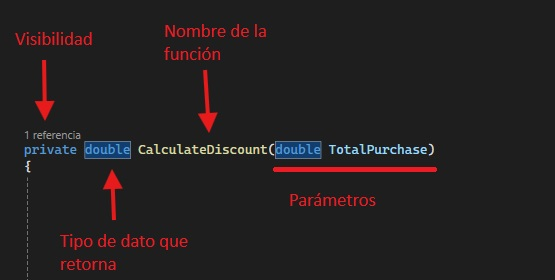

# Funciones
Las funciones se pueden definir como bloques de código que realizan tareas específicas dentro de una aplicación, generalmente en respuesta a eventos como la carga de un formulario o el clic en un botón. <br>
El uso de funciones en el desarrollo de aplicaciones permite separar la lógica en unidades más pequeñas y manejables. Esto no solo facilita el mantenimiento y la depuración del código, sino que también promueve la reutilización del código y mejora la legibilidad.<br>

A las funciones asociadas a una clase u objeto se les dice **MÉTODOS**. 
Un método es esencialmente una función que opera sobre los datos de la instancia de la clase (o sobre la propia clase, en el caso de métodos estáticos), y está definido dentro de una clase.

Existen dos tipos de funciones:
- Funciones sin retorno (void)
	```csharp
		public class Persona()
		{
			//Este método solo imprime un saludo en la consola
			//No tiene un retorno, por eso es void
			public void Saludar()
			{
				Console.WriteLine("Hola mundo");
			}
		}
	```
- Funciones con retorno
	```csharp
		public class Persona()
		{
	
			public Persona()
			{
				//Llamada al método saludar y captura de su valor de retorno
				string saludo = Saludar();
				Console.WriteLine(saludo);
			}

			public string Saludar()
			{
				string saludo = "Hola mundo";
				return saludo; //Valor de retorno del tipo string
			}
		}
	```

## Estructura de una función


## Parámetros y argumentos en una función
En la programación, **parámetros** y **argumentos** son dos conceptos muy importantes, y aunque parezcan muy similares,
la clave para diferenciarlos está en su implementación en las funciones.

- **Los parámetros**:
    Son variables definidas en la creación del método o función.
	Actúan como referencia a un valor cuando la función es llamada.
	```csharp
		public void Saludar(string name)
		{
			//name es un parámetro del método Saludar()
			Console.WriteLine($"Hola {name}");
		}
	```
- **Los argunentos**:
    Son los valores enviado al invocar o llamar una función, estos valores se asignan a los parámetros definidos en la función.
	```csharp
		public class Persona()
		{
			public Persona()
			{
				string nameText = "Juan" //nameText es un argumento
				Saludar(nameText)        //nameText es enviado como argumento al método Saludar()
			}

			public void Saludar(string name)
			{
				//name es un parámetro del método Saludar()
				Console.WriteLine($"Hola {name}");
			}
		}
	```