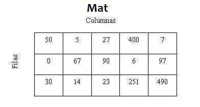
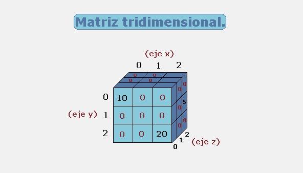
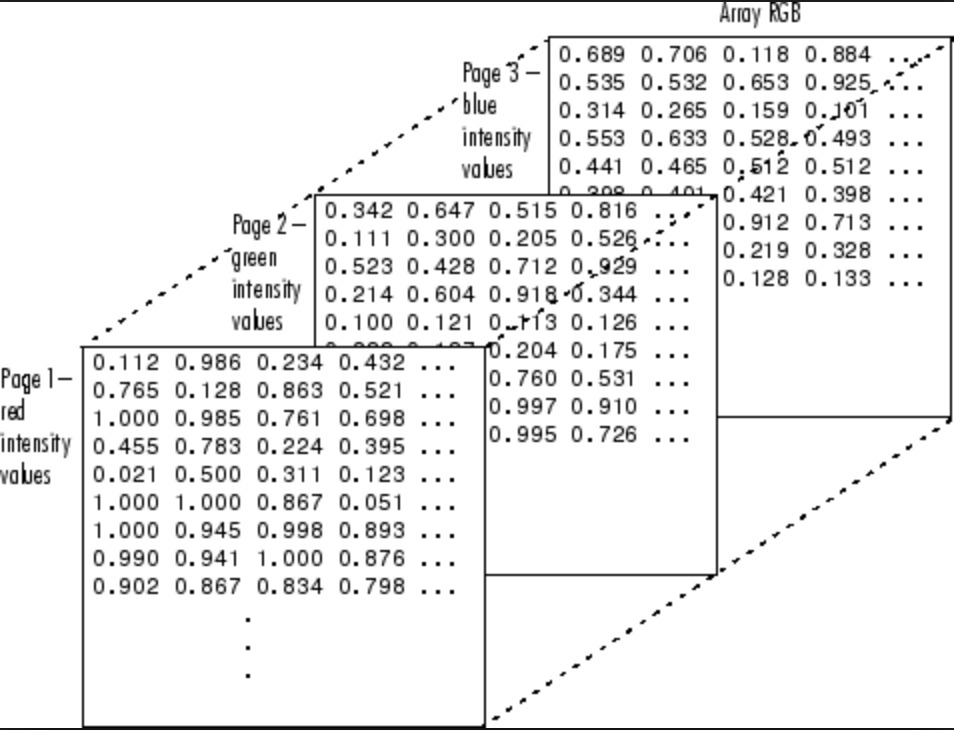

# Matrices
Son una estructura de colección de datos similar a los arrays, al diferencia radica que mientras los arrays son unidimensionales,
las matrices pueden tener varias dimensiones, pero su inicialización y asignación de valores es similar a la de los arrays.

## Dimensiones
La dimension base o inicial de una matriz es la **bi-dimensional**, que se compone de filas y columnas, 
a esta clase de matrices se les conoce como 2D.



```csharp
	//string	=> Tipo de dato de la matriz
	//[,]		=> Indica que es una matriz bi-dimensional
	//new string[4, 3] => Indica quie la matriz se compone de 4 filas y 3 columnas

	string[,] products = new string[4, 3];

	products[0, 0] = "Código";		//Se asigna "Código" en la fila 0 y columna 0
    products[0, 1] = "Producto";	// Se asigna "Producto" en la fila 0 y columna 1

	string value = products[3, 0]; //Obtiene el valor de la matriz
    string dimenssions = (products.Rank).ToString(); //La propiedad Rank devuelve la cantidad de dimensiones 
```
<br>
Después de las matrices bi-dimensionales siguen las **tri-dimensional** la cual se comporta como el plano cartesiano entre los ejes (X, Y, Z).
Estas matrices son conocidas como 3D, su utilidad podría llevarse a los juegos 3D donde cada elemento dentro de la matriz guardaría un pixel.



```csharp
	//string[,,] => Indica una matriz tridimensional
    string[,,] sales = new string[4, 4, 5];

	sales[0, 3, 0] = "Azúcar";

    string value = sales[1, 0, 2];
    string dimenssions = (sales.Rank).ToString(); //Dimensiones del la matriz = 3
```
<br>
Luego de esto siguen las matrices **multidimensional** que se componen de mas dimensiones, como ejemplo se puede dar en TensorFlow, donde se utiliza esta clase de matrices
para crear **tensores** que son una estructura que permite almacenar y manipular datos, en este contexto son de gran importancia 
para implementar y operar modelos de redes neuronales.



## Consideraciones
- Las matrices bi-dimensionales pueden ser recorridas en un bucle foreach aunque esta clase de bucles tiene como objetivo recorrer
	colecciones de datos uni-dimensionales o simples.
	Por esta razón a pesar que se pueda iterar una matriz bi-dimensional con un foreach, al intentar hacer lo mismo con matrices de mayores dimensiones, obtenemos una excepción,
	en ese caso lo recomendable es usar bucles for anidados.

	```csharp
    	//Opciones para iterar sobre una matriz bi-dimensional
    		//for anidados
			private void IterateOverBiDimensionalMatrix(string[,] matrix)
            {
                int FirstDimession = matrix.GetLength(0); //Obtiene la primera dimensión (filas)
                int SecondDimession = matrix.GetLength(1); //Obtiene la segunda dimensión (columnas)

                LiData.Items.Clear();

                for (int row = 0; row < FirstDimession; row++) 
                {
                    string dataRow = string.Empty;

                    for(int col = 0; col < SecondDimession; col++)
                    {
                        dataRow += $"{matrix[row, col]} ";
                    }

                    LiData.Items.Add(dataRow);
                }
            }

			//foreach
			private void IterateOverMatrixForeach(string[,] matrix)
            {
                LiData.Items.Add("");
                LiData.Items.Add("Foreach");

                foreach (var row in matrix) 
                {
                    LiData.Items.Add(row);
                }

            }
	```

    ```csharp
    	//for anidado para iterar sobre matrices multidimensionales
        //Solo cambias el argumento del método por el tipo de dato y la dimension de la matriz
        private void IterateOverThreeDimensionalMatrix(string[,,] matrix)
        {
            int FirsDimession = matrix.GetLength(0);
            int SeconDimenssion = matrix.GetLength(1);
            int ThirdDimenssion = matrix.GetLength (2);

            for (int first = 0; first < FirsDimession; first++)
            {
                string RowData = string.Empty;

                for(int second = 0; second < SeconDimenssion; second++)
                {
                    for(int third = 0; third < ThirdDimenssion; third++)
                    {
                        RowData += $"{matrix[first, second, third]} ";
                    }
                }

                LiData.Items.Add(RowData);
            }
        }
	```
- Aunque en el contexto de c# no es común usar matrices de 3 dimensiones o más, si es posible crearlas, su inicialización y asignación de datos es similar los vistos anteriormente.
	
	```csharp
    	//Matriz de 4 dimensiones
    	string [,,,] matrix = new string[5,5,5,5];
		matrix[0, 0, 0, 0] = "elemento1";
		
		//Matriz de 5 dimensiones
    	string [,,,,] matrix = new string[5,5,5,5,5];
		matrix[0, 0, 0, 0, 0] = "elemento1";
		
		//Matriz de 6 dimensiones
    	string [,,,,,] matrix = new string[5,5,5,5,5,5];
		matrix[0, 0, 0, 0 ,0 ,0] = "elemento1";

		//...
	```